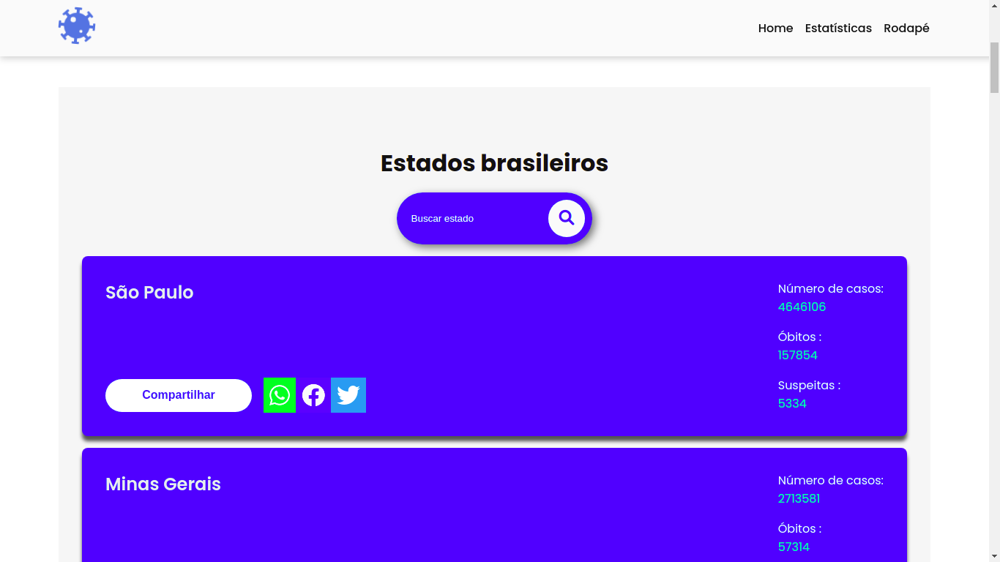

# Esse site tem dados reais da covid19!

## Sobre

 - [Link para visualização](https://coronabrr.netlify.app/)
 - [Link para repositório](https://github.com/vgabrielk/CovidAPI)

## Estados brasileiros

- Pesquisar seu estado e saber a situação
- Número de casos
- Número de óbitos
- Número de suspeitas

## Stack utilizada

**Front-end:** - ReactJS

**Libs:** AOS animate to scroll
## Autor

`Vitor Gabriel`

- [Github ](https://www.github.com/vgabrielk)
- [Linkedin](https://www.linkedin.com/in/vitorfelix03/)
## Paleta de cores do projeto
| Cor               | Hexadecimal                                                |
| ----------------- | ---------------------------------------------------------------- |
| Cor Primária       |  #006eff |
| Cor da fonte       |  #111 |
| Cor secundária       |  #00ff9d |
| Cor neutra       |  #fafafa |

